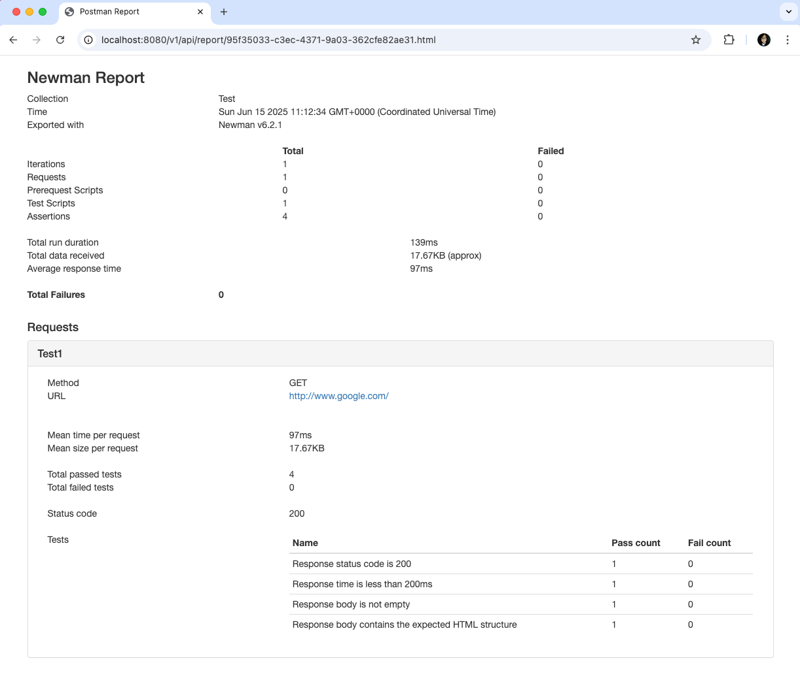

# 🧪 Newman RESTful API Runner
A lightweight Spring Boot API that accepts a Postman collection (JSON file), executes it using [Newman](https://www.npmjs.com/package/newman), and generates an HTML report that can be retrieved via a REST endpoint.

[](https://hub.docker.com/r/chunglunlu/newman-api-test)

- **Author:** Chung-Lun LU
- **Date:** June 15, 2025

## 🚀 Features
- 📥 Accepts `POST` requests with a Postman collection `.json` file.
- ⚙️ Executes tests via Newman (Postman's CLI).
- 📊 Generates HTML reports with `newman-reporter-html`.
- 🧩 Supports optional Postman `environment.json` file.
- 🌐 Serves reports via REST endpoint - provides a `GET` API to view/download the report.
- 🐳 Dockerized for deployment with Node.js and Java 17.
- 

## 📡 API Endpoints

### 🔹 `POST /v1/api/executeTest`
Upload a Postman collection JSON file and trigger test execution.

#### Request
- Content-Type: `multipart/form-data`
- Required Field:
    - `collection` — Postman collection file (`.json`)
- Optional Field:
    - `environment` — Postman environment file (`.json`)

#### 🧪 Example with `curl` (Collection Only)
```bash
curl -X POST http://localhost:8080/v1/api/executeTest \
  -H "Content-Type: multipart/form-data" \
  -F "collection=@/path/to/collection.json"
```
#### 🧪 Example with `curl` (Collection + Environment)
```bash
curl -X POST http://localhost:8080/v1/api/executeTest \
  -H "Content-Type: multipart/form-data" \
  -F "collection=@/path/to/collection.json" \
  -F "environment=@/path/to/environment.json"
```

#### Response
```json
{
  "report_url": "/v1/api/report/abcd1234.html"
}
```

### 🔹 `GET /v1/api/report/{filename}`
Retrieve the generated HTML report.
#### Example
```bash
GET http://localhost:8080/v1/api/report/abcd1234.html
```
✅ Returns HTML file as inline content.

❌ Returns 404 if not found or 403 if file extension is invalid.


## 🐳 Docker Support

### 🔧 Build Docker Image
```bash
docker build -t chunglunlu/newman-api-test:0.0.3 .
```
### ▶️ Run Docker Container
```bash
  docker run -p 8080:8080 chunglunlu/newman-api-test:0.0.3
```

## ⚙️ Configuration (application.properties)
```properties
server.port=8080
# File Storage
upload.folder=/tmp/uploads
report.folder=/tmp/reports
# Serve static resources (reports)
spring.resources.static-locations=classpath:/static/,file:/tmp/
```
💡 You can override these with -e flags in Docker or provide a custom application.properties.
### 📎 Example Project Structure (Volume)
```
/tmp/uploads/    ← Collection + environment JSONs
/tmp/reports/    ← Generated HTML reports
```

## Kubernetes deploy
```bash
kubectl create namespace newman
kubectl apply -f configmap.yaml -n newman
kubectl apply -f deployment.yaml -n newman
kubectl apply -f svc.yaml -n newman
```

### Kubernetes delete
```bash
kubectl delete svc newman-svc -n newman
kubectl delete deployment newman-deployment -n newman
kubectl delete configmap newman-config -n newman
```

## 🔧 Dependencies
- Java 17 (via openjdk:17-slim)
- Node.js (via setup script)
- Newman CLI
- newman-reporter-html
- Spring Boot 3.x

## 📁 Project Structure
```
src/
  main/
    java/
      com.chunglun.sre.rest.NewmanRestfulService
    resources/
      application.properties
K8s/
  configmap.yaml
  deployment.yaml
  svc.yaml
Dockerfile
README.md
```
## 📄 Sample


## 👨‍💻️ Author
Developed by Chung-Lun Lu